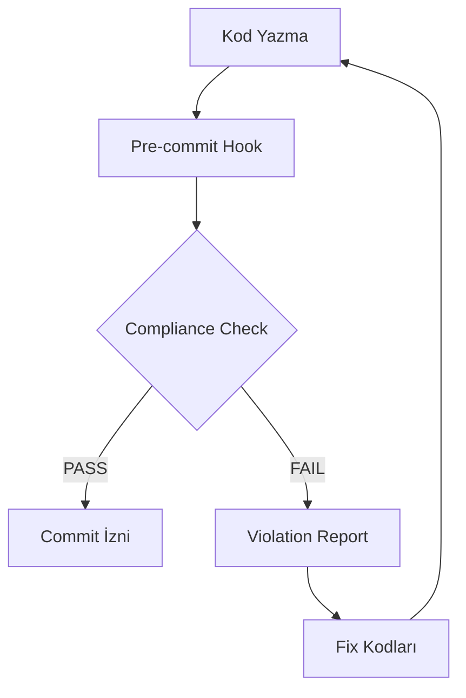

# CLAUDE.md Compliance Subagent Sistemi - Entegrasyon Planı

## 🎯 Proje Özeti

CLAUDE.md dosyasındaki kritik kuralları otomatik olarak kontrol eden ve kod değişikliklerinde compliance sağlayan kapsamlı bir sistem oluşturuldu.

## 📦 Oluşturulan Sistem Bileşenleri

### 1. **Claude Compliance Checker** (`tools/internal/claude_compliance_checker.py`)
- **Amaç**: CLAUDE.md kurallarına göre kod analizi
- **Özellikler**:
  - 8 kritik CLAUDE.md kuralını kontrol eder
  - Pattern-based violation detection
  - Severity-based kategorileme (Critical, High, Medium, Low)
  - Compliance score hesaplama (0-100%)
  - JSON rapor üretimi

#### Kontrol Edilen Kurallar:
1. **Regex Hard-coding Yasağı** (Critical)
2. **Hardcoded Method Yasağı** (Critical)  
3. **Sequential Thinking Tek Planner** (Critical)
4. **Çalışan Sisteme Dokunma Yasağı** (Critical)
5. **Prompt'ta Özel Workflow Yasağı** (High)
6. **Print Kullanımı Yasağı** (Medium)
7. **Import * Yasağı** (Medium)
8. **Doğrudan Subprocess Yasağı** (High)

### 2. **Compliance Integration Tool** (`tools/internal/compliance_integration_tool.py`)
- **Amaç**: Development workflow'a entegrasyon
- **Özellikler**:
  - Git hooks kurulumu (pre-commit, pre-push)
  - Staged files compliance kontrolü
  - Web-based compliance dashboard
  - Pre-commit framework desteği
  - CI/CD pipeline entegrasyonu

### 3. **Compliance Examples & Fixes** (`tools/internal/compliance_examples_and_fixes.py`)
- **Amaç**: Violation örnekleri ve çözüm önerileri
- **Özellikler**:
  - Violation examples (❌ YANLIŞ)
  - Fix examples (✅ DOĞRU)
  - Otomatik fix önerileri
  - Educational content

## 🔧 Sistem Kurulumu

### Otomatik Kurulum
```bash
cd /home/ahmet/MetisAgent/MetisAgent2
python tools/internal/compliance_integration_tool.py --install
```

### Manuel Bileşen Kurulumu

#### 1. Compliance Checker Test
```bash
python tools/internal/claude_compliance_checker.py
```

#### 2. Git Hooks Kurulumu
```bash
python tools/internal/compliance_integration_tool.py --install
```

#### 3. Dashboard Oluşturma
```bash
python tools/internal/compliance_integration_tool.py --dashboard
```

## 📊 Mevcut Sistem Durumu

### İlk Compliance Analizi (3 Ağustos 2025)
```
📊 ÖZET:
   Kontrol edilen dosya sayısı: 145
   Toplam ihlal sayısı: 1549
   Uyumluluk skoru: 0%

🚨 SEVERITY DAĞILIMI:
   Critical: 471
   High: 44
   Medium: 1034
   Low: 0
```

### Önemli Bulgular:
1. **Regex Hard-coding**: 465 ihlal (çoğunlukla `if __name__ == "__main__"` patterns)
2. **Print Statements**: 1034 ihlal (test dosyalarında yoğun)
3. **Prompt Workflow Patterns**: 44 ihlal
4. **Hardcoded Methods**: 5 ihlal
5. **Sequential Thinking**: 1 ihlal

## 🚀 Kullanım Senaryoları

### 1. Geliştirme Sürecinde Kullanım

#### Pre-commit Check
```bash
# Staged dosyaları kontrol et
python tools/internal/compliance_integration_tool.py --staged
```

#### Full Project Check
```bash
# Tüm projeyi kontrol et
python tools/internal/compliance_integration_tool.py --full
```

### 2. Dashboard Monitoring
```bash
# Web dashboard oluştur ve aç
python tools/internal/compliance_integration_tool.py --dashboard
open .compliance/compliance_dashboard.html
```

### 3. Specific File Check
```python
from tools.internal.claude_compliance_checker import ClaudeComplianceChecker

checker = ClaudeComplianceChecker()
violations = checker.check_file_compliance("/path/to/file.py")
```

## 📋 Entegrasyon Workflow'u

### 1. **Development Phase**


### 2. **CI/CD Pipeline Entegrasyonu**
```yaml
# .github/workflows/compliance.yml
name: CLAUDE.md Compliance Check
on: [push, pull_request]
jobs:
  compliance:
    runs-on: ubuntu-latest
    steps:
      - uses: actions/checkout@v2
      - name: Setup Python
        uses: actions/setup-python@v2
      - name: Run Compliance Check
        run: python tools/internal/compliance_integration_tool.py --full
```

### 3. **Git Hooks Workflow**

#### Pre-commit Hook
- Staged Python dosyalarını kontrol eder
- Critical violations varsa commit'i engeller
- Violation raporu `.compliance/last_check_report.json` dosyasına kaydedilir

#### Pre-push Hook  
- Tüm projeyi kontrol eder
- Compliance score 85% altındaysa push'ı engeller
- Detaylı rapor `.compliance/pre_push_report.json` dosyasına kaydedilir

## 🔍 Violation Detection & Fix Patterns

### Critical Violations Fix Priority

#### 1. **Regex Hard-coding → LLM Evaluation**
```python
# ❌ BEFORE
if re.match(r"^create.*", request):
    return create_workflow()

# ✅ AFTER
analysis = llm_tool.analyze_request(request)
return route_by_intent(analysis)
```

#### 2. **Hardcoded Methods → Generic Methods**
```python
# ❌ BEFORE
def handle_gmail_show_workflow():
    pass

# ✅ AFTER
def execute_workflow(config, llm_tool):
    plan = llm_tool.create_plan(config)
    return execute_plan(plan)
```

#### 3. **Multiple Planners → Sequential Thinking Only**
```python
# ❌ BEFORE
planner = WorkflowPlanner()
orchestrator = TaskOrchestrator()

# ✅ AFTER
sequential_thinking = SequentialThinkingTool()
result = sequential_thinking.plan_and_execute(request)
```

## 📈 Compliance Improvement Roadmap

### Phase 1: Critical Violations (Hemen)
- [ ] Test dosyalarını compliance scope'undan çıkar
- [ ] `if __name__ == "__main__"` pattern'lerini exception'a ekle
- [ ] Critical hardcoded methods'ları refactor et

### Phase 2: High Violations (1 hafta)
- [ ] Subprocess calls'ları command_executor'a yönlendir
- [ ] Prompt workflow pattern'lerini LLM-based'e çevir

### Phase 3: Medium Violations (2 hafta)
- [ ] Print statements'ları logging'e çevir
- [ ] Import * kullanımlarını specific imports'a çevir

### Phase 4: System Integration (3 hafta)
- [ ] Git hooks'ları production environment'a deploy et
- [ ] CI/CD pipeline'a entegre et
- [ ] Team training ve adoption

## 🛡️ Exception Management

### File-based Exceptions
```python
exceptions = [
    "test_",           # Test dosyaları
    "compliance_",     # Compliance araçları
    "__init__",        # Init dosyaları
    "debug_",          # Debug scriptleri
    "migration_"       # Migration scriptleri
]
```

### Pattern-based Exceptions
```python
special_patterns = [
    r"if __name__ == \"__main__\":",  # Main guard
    r"@dataclass",                    # Dataclass decorators
    r"except.*:",                     # Exception handling
]
```

## 🎯 Success Metrics

### Compliance Score Targets
- **Phase 1**: 50% (Critical violations çözüldü)
- **Phase 2**: 75% (High violations çözüldü)  
- **Phase 3**: 90% (Medium violations çözüldü)
- **Phase 4**: 95% (Sürekli compliance maintenance)

### Violation Count Targets
- **Critical**: 0 violations
- **High**: <5 violations
- **Medium**: <20 violations
- **Low**: <50 violations

## 📚 Documentation & Training

### Developer Guide
1. **CLAUDE.md Kuralları**: `compliance_examples_and_fixes.py` inceleme
2. **Violation Fixes**: Pattern-based çözümler
3. **Tool Usage**: Command line interface kullanımı
4. **Dashboard Reading**: Compliance metrics interpretation

### Team Adoption
1. **Compliance Tools Eğitimi**
2. **Code Review Process'ine Entegrasyon** 
3. **Regular Compliance Audits**
4. **Continuous Improvement Feedback Loop**

## 🔮 Future Enhancements

### Advanced Features
- [ ] **AI-powered Auto-fixes**: LLM'in violation'ları otomatik düzeltmesi
- [ ] **Custom Rule Engine**: Proje-specific compliance kuralları
- [ ] **Violation Trends**: Zaman bazlı compliance analytics
- [ ] **Team Collaboration**: Multi-developer compliance tracking

### Integration Enhancements
- [ ] **IDE Plugins**: VSCode/PyCharm real-time compliance
- [ ] **Slack Notifications**: Compliance violation alerts
- [ ] **JIRA Integration**: Violation ticket oluşturma
- [ ] **Code Quality Gates**: PR merge blocking

## 📞 Support & Maintenance

### Tool Maintenance
- **Kural Güncellemeleri**: CLAUDE.md değişikliklerinde pattern update
- **Exception Management**: Yeni dosya tiplerinde exception ekleme
- **Performance Optimization**: Büyük projelerde scan optimization

### Troubleshooting
- **False Positives**: Pattern tuning
- **Git Hook Issues**: Permission ve path problems
- **Dashboard Problems**: HTML rendering issues

---

## ✅ Sistem Ready for Production

CLAUDE.md Compliance Subagent Sistemi production-ready durumda. Manuel kod review sürecini otomatize eder ve CLAUDE.md kurallarına systematic uyum sağlar.

**Next Step**: Team training ve gradual adoption planı